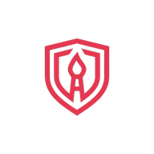

# ArtShield

<p align="center">
  
</p>

<p align="center">
  Free, open-source, browser-based tools to help artists protect their work from theft.
</p>

<p align="center">
  <a href="https://art-shield.vercel.app"><strong>art-shield.vercel.app</strong></a>
</p>

---

## What it does

ArtShield is a collection of tools for artists who post their work online. Everything runs 100% in the browser -- your images never leave your device. No server uploads, no accounts, no tracking.

### Proof of Ownership
Upload your artwork and generate a SHA-256 hash certificate with a timestamp. A unique cryptographic fingerprint that proves you had the original file. Email it to yourself for a third-party timestamp.

### Watermark (3 modes)
- **Text watermark** -- real-time preview with adjustable font size, opacity, and 6 positions including tile/repeat
- **Signature / image overlay** -- upload your signature or logo, adjust scale/opacity/position, with both basic threshold and **AI-powered background removal** (BiRefNet/RMBG-1.4 via Transformers.js, runs in-browser)
- **Invisible watermark** -- LSB steganography that embeds hidden messages into pixel data, invisible to the naked eye

### Image Resizer
Downscale your art before posting. Social media presets (1200px, 1500px, 600px), custom dimensions, JPEG quality slider, PNG/JPEG format toggle. Keep full-res originals as proof.

### Reverse Image Search
Upload your art and search Google, TinEye, Yandex, and Bing simultaneously to find unauthorized reposts.

### DMCA Takedown Generator
Generate a properly formatted DMCA takedown notice for **Twitter/X, Instagram, TikTok, YouTube, Reddit, Pinterest, and DeviantArt**. Includes direct links to each platform's copyright form.

### Resources
Curated tools and platforms the art community recommends: Nightshade, Glaze, Pixsy, Cara, TinEye, and more. Includes anti-AI tools, reverse search engines, artist-friendly platforms, photo forensics, and legal/DMCA links.

## Privacy

- **Zero server uploads.** All image processing uses the Canvas API, Web Crypto API, and Transformers.js (for AI bg removal).
- **No analytics, no cookies, no tracking.**
- AI model (~44MB) is downloaded once from Hugging Face and cached in your browser's IndexedDB.

## Run locally

```bash
git clone https://github.com/LAZERAI/art-shield.git
cd art-shield
npm install
npm run dev
```

Open [localhost:3000](http://localhost:3000)

## Tech stack

- Next.js 16 (App Router)
- React 19
- Tailwind CSS v4
- Web Crypto API (SHA-256 hashing)
- Canvas API (watermarking, certificates, image processing)
- Transformers.js (BiRefNet/RMBG-1.4 for AI background removal)
- LSB steganography (custom implementation)

## Contributing

Issues and PRs welcome. If you know a tool or resource that should be listed, open an issue.

## License

MIT
